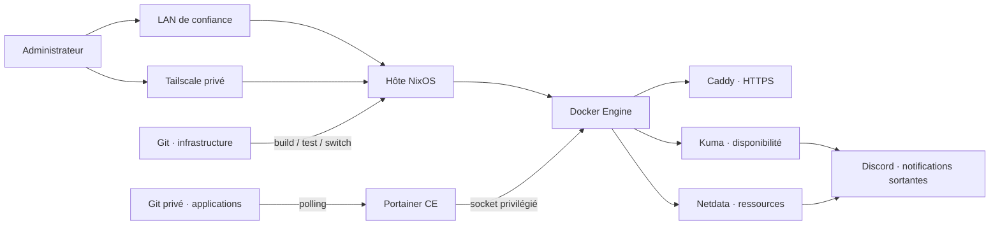

# Homelab · Architecture & exploitation

Un homelab personnel pour apprendre l'administration système et héberger ses
services. NixOS décrit l'hôte ; Docker Compose décrit les applications ; Portainer
applique leur configuration Git. L'administration reste privée, en LAN ou via
Tailscale.

Ce dossier reprend les habitudes d'un design document et d'un manuel SRE, à
l'échelle d'une seule machine : pas de haute disponibilité fictive, de
certification implicite ni de garantie « tout est sécurisé ».

## Vue d'ensemble

Vue logique ; les chemins réseau exacts sont dans [NETWORK.md](docs/NETWORK.md).

## Documentation

| Besoin | Document |
| --- | --- |
| Comprendre les composants et les compromis | [Architecture](docs/ARCHITECTURE.md) |
| Trouver une URL, un port ou un chemin TLS | [Réseau et accès](docs/NETWORK.md) |
| Connaître l'état réellement attesté | [État et limites](docs/STATUS.md) |
| Déployer une modification depuis Git | [GitOps et changements](docs/GITOPS.md) |
| Administrer, mettre à jour, revenir en arrière | [Exploitation](docs/OPERATIONS.md) |
| Diagnostiquer une panne | [Runbooks](docs/RUNBOOKS.md) |
| Comprendre les métriques et alertes | [Supervision](docs/SUPERVISION.md) |
| Ajouter un service proprement | [Contrat conteneurs](docs/CONTAINERS.md) |
| Recréer la plateforme et inventorier son état | [Amorçage](docs/BOOTSTRAP.md), [données](docs/DATA.md) |
| Examiner les frontières de confiance | [Politique](SECURITY.md), [menaces](docs/THREAT_MODEL.md) |
| Retrouver les choix et preuves historiques | [Décisions](DECISIONS.md), [rapports](security/reports/README.md) |

L'[index](docs/README.md) précise l'ordre de lecture et la convention de preuve.

## Sources de vérité

- Ce dépôt public : `flake.nix`, `flake.lock`, `hosts/`, `modules/`.
- [homelab-apps](https://github.com/sobekkkk/homelab-apps), dépôt privé :
  Compose, images épinglées, configurations et guides par application.
- Serveur : génération active, état Docker, volumes, secrets et sessions.
  Un commit poussé ne prouve pas qu'il est déployé.
- Services externes : ACL et identité Tailscale, accès GitHub, webhooks Discord.
  Ils ne sont pas complètement provisionnés par ces dépôts.

`stacks/uptime-kuma/compose.yaml` est une référence historique d'amorçage,
pas la source du déploiement actuel. Ne pas en faire une seconde stack.

## Situation au 30 septembre 2026

Le socle, l'accès privé et les interfaces Kuma/Netdata ont fait l'objet de
vérifications précédentes. La réception des tests Discord Netdata a été montrée
par l'opérateur. Le chargement des 17 nouvelles règles reste à attester après
le correctif applicatif `768f95f`. Les audits ont des limites explicites :
voir [STATUS.md](docs/STATUS.md), pas une checklist marketing.

Les sauvegardes sont prises en charge séparément par le propriétaire et hors
du chantier actuel. Ce dossier n'en revendique ni configuration ni test.

## Principes

- Administration uniquement LAN/Tailscale ; pas de Funnel.
- SSH par clé ; pas de login root distant ni de forwarding SSH.
- Pas de groupe Docker pour `sobek` ; Portainer est privilégié.
- Aucun secret dans Git, un ticket, une capture ou une commande partagée.
- Documentation et contrôles mis à jour avant chaque commit fonctionnel.
- Diff relu, activation autorisée et retour arrière prévu avant changement.

[Contribuer](CONTRIBUTING.md) · [Consignes agents](AGENTS.md) ·
[Usage Codex existant](docs/CODEX.md).
