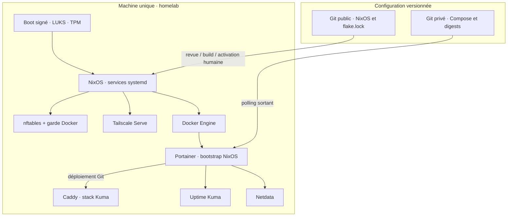
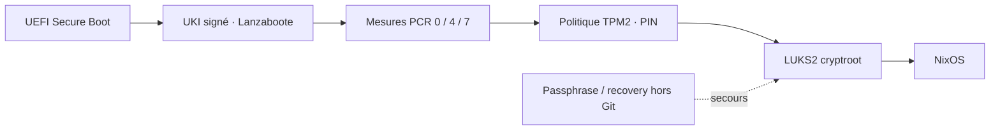

# Architecture de référence

## 1. Objectifs et non-objectifs

Extension au 2026-10-01 : une VM réseau dédiée fournit la sortie privée des
clients qui sélectionnent son exit node. Elle n'est pas un conteneur Portainer.
Voir [architecture et exploitation de la passerelle](PRIVACY_GATEWAY.md),
[guide clients](PRIVACY_GATEWAY_CLIENTS.md) et [preuves](PRIVACY_GATEWAY_VALIDATION.md).
Les accès administratifs LAN/Tailscale de l'hôte restent indépendants.

Héberger des services personnels, administrer en LAN et hors domicile via
Tailscale, reconstruire la configuration depuis Git. Priorités : lisibilité,
maîtrise des accès, traçabilité et récupération. Propriétaire/opérateur : sobek.

Pas de service public, de multi-tenant hostile, de cluster ni de Kubernetes.
Une seule machine est un point unique de défaillance. Le déploiement déclaratif
ne restaure pas les données, secrets, identités et inscriptions externes.

## 2. Découpage logique

NixOS démarre Portainer : pas de dépendance circulaire à son propre
déploiement. Caddy partage le cycle de vie du stack Kuma ; arrêter ce stack
coupe aussi les proxys LAN et les backends Tailscale de Kuma/Netdata.
Portainer via Tailscale reste indépendant de Caddy : il relaie directement
`127.0.0.1:9443`.

## 3. Inventaire

| Composant | Responsabilité | Source | État local |
| --- | --- | --- | --- |
| NixOS x86_64 | Services et hôte | flake, lock, hosts | Générations, état hors Git |
| Lanzaboote | UKI signés, boot mesuré | modules/boot.nix | sbctl, EFI, TPM |
| OpenSSH | Administration par clé | modules/ssh.nix | Clés hôte et cliente |
| Tailscale | Transport privé, Serve | modules/tailscale.nix | Identité, politique externe |
| Docker | Moteur Unix local | modules/containers.nix | Images, réseaux, volumes |
| Portainer CE 2.39.0 | Administration Docker | modules/containers.nix | portainer_data |
| Caddy 2.11.4-alpine | Proxy et PKI LAN | apps/uptime-kuma/compose.yaml du dépôt privé | Volumes Caddy |
| Kuma 2.5.5 | Sondes et notifications | Même stack applicatif | uptime-kuma-data |
| Netdata v2.11.1 | Hôte, systemd, cgroups, alertes | apps/netdata/compose.yaml du dépôt privé | Trois volumes |
| auditd / journald | Traçabilité bornée | modules/auditing.nix | Journaux locaux |
| Snapshot curaté | Preuves non privilégiées | modules/security-snapshot.nix | Snapshots root-owned |

Versions : références déclarées lors de cette revue, pas « dernières versions ».
Les digests complets restent dans le code. `stateVersion = 26.05` fixe des
comportements de compatibilité ; il n'atteste pas la génération exécutée.

## 4. Démarrage et chiffrement

Le code demande PCR 0/4/7 et le token TPM2 dans l'initrd. L'enrôlement, le PIN,
les clés et le header sont de l'état local : ces modules ne les recréent pas.
PCRLock peut omettre un PCR non reconnu lors d'un switch ; lire le masque
effectif. Un boot réussi hier n'atteste pas les boots futurs.

## 5. Frontières de privilèges

- sobek : compte normal, wheel et NetworkManager ; sudo exige un mot de passe.
- Portainer : socket Docker, impact potentiellement équivalent à root.
- Kuma : pas de socket Docker ; réseau interne et bridge de sortie dédié.
- Netdata : pas de socket Docker, mais PID hôte, SYS_PTRACE, racine hôte et
  D-Bus montés. Un montage ro ne rend ni ptrace ni D-Bus inoffensif.
- AppArmor : LSM activé ; aucun profil applicatif spécifique enforcing
  déclaré ici. Ce n'est pas un confinement applicatif prouvé.

Voir [STATUS.md](STATUS.md) et [THREAT_MODEL.md](THREAT_MODEL.md).

## 6. Dépendances et défaillances

| Dépendance perdue | Effet | Repli |
| --- | --- | --- |
| Caddy / stack Kuma | Proxys Kuma et Netdata indisponibles | SSH ; Portainer Tailscale direct |
| Tailscale / client / ACL | Administration distante coupée | LAN ou console physique |
| Docker | Tous les conteneurs affectés | SSH/systemd, diagnostic hôte |
| GitHub | Nouveaux déploiements bloqués | Services existants, commits locaux |
| DNS / Internet sortant | Pulls et notifications perturbés | Diagnostics locaux |
| Discord | Notifications perdues/retardées | Tableaux ; réception non garantie |
| Disque / serveur | Applications et supervision locale perdues | Opérateur ; sonde indépendante non établie |

Docker live-restore est déclaré, pas une garantie lors d'un reboot ou d'une
migration applicative. Serve oneshot actif n'atteste pas la santé de son backend.
Les dépendances sont documentées dans les [runbooks](RUNBOOKS.md).

## 7. Organisation NixOS

| Module | Fonction |
| --- | --- |
| base / networking | Locale, fuseau Paris, flakes, NetworkManager |
| boot | Lanzaboote, initrd systemd, chiffrement |
| users / sudo / ssh | Identité et frontières de privilèges |
| firewall / tailscale | Accès privé et relais |
| hardening | Sysctl, LSM AppArmor, restrictions noyau/core dumps |
| auditing / security-snapshot | Journaux et preuves |
| containers | Moteur, bootstrap Portainer, réseaux et garde |
| maintenance | GC/optimisation ; pas d'auto-upgrade |
| packages | Outils déclarés |

Toute évolution précise besoin, exposition, privilèges, données, budget,
validation et rollback : [CONTAINERS.md](CONTAINERS.md).
