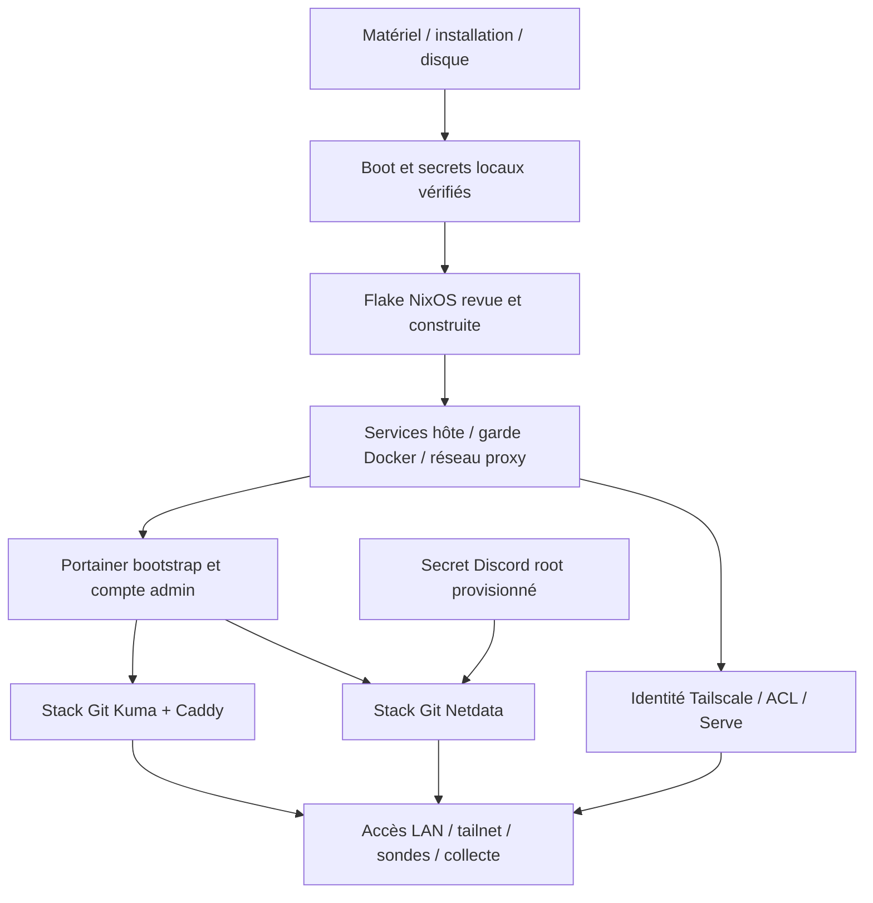

# Amorçage et reconstruction

## 1. Portée

Ordre de reconstruction, pas script d'installation aveugle.
Les commandes disque, TPM, clés et firmware sont volontairement exclues :
cibles et moyens de récupération doivent être vérifiés séparément.
Sauvegardes : propriétaire, hors du chantier courant.

Prérequis : matériel x86_64 compatible, console/PIN, accès LAN, installation
NixOS adaptée, état sensible nécessaire disponible sur un canal sûr.
La hardware-configuration d'origine ne doit pas être réutilisée sur un
autre disque sans revue des UUID, partitions, montage EFI et chiffrement.

## 2. Ordre de dépendances

Ne pas publier le premier Portainer longtemps sans créer son administrateur.
Vérifier l'empreinte TLS auto-signée hors bande et contrôler l'origine de la
connexion. Après changement matériel, la politique TPM peut ne plus s'appliquer.

## 3. Infrastructure

Récupérer la révision approuvée dans un dépôt appartenant à sobek ; vérifier
flake.lock et les imports. Évaluation, build puis activation autorisée selon
[GITOPS.md](GITOPS.md). Vérifier boot, SSH, firewall et snapshot.

docker-homelab-proxy-network crée le bridge externe avant Portainer.
docker-portainer dépend de ce réseau et de docker-lan-guard.
Pas de groupe Docker, de mode sudo Codex ou d'API TCP Docker comme raccourci.

## 4. Identités externes

Connecter le nœud au bon tailnet, vérifier la politique et activer Serve côté
fournisseur si nécessaire. Les unités Serve ne peuvent pas contourner une
fonction désactivée dans le tailnet. Fournir l'accès GitHub de lecture limité
au dépôt applicatif dans Portainer, pas dans la flake.

Résoudre home.arpa côté clients LAN et importer la CA vérifiée.
Les clés existantes de Caddy, SSH et Tailscale déterminent les identités :
une réinitialisation peut exiger une nouvelle vérification sur les clients.

## 5. Applications

Créer le stack Git uptime-kuma-gitops :
repository homelab-apps, main, apps/uptime-kuma/compose.yaml, polling.
Les volumes sont nommés explicitement ; ne pas déployer le Compose historique
du dépôt infrastructure en parallèle.

Provisionner le secret Netdata côté hôte avant sa stack. Déployer
apps/netdata/compose.yaml sous le nom convenu netdata-gitops. Le nom réel
du conteneur peut être préfixé par Compose ; le découvrir dans Portainer.

Ne pas cloner les volumes d'une application non arrêtée sans comprendre son
format. Git seul crée des volumes vides, pas une restauration de leur contenu.

## 6. Recette de mise en service

- Secure Boot et cryptroot ; masque PCRLock reconnu, secours disponibles.
- SSH par clé depuis les origines prévues ; pas de root/password/forwarding.
- Garde Docker présente et seuls ports attendus publiés.
- Portainer et interfaces LAN/tailnet : bonne application et TLS valide.
- Kuma : sondes pertinentes ; Netdata : points récents, règles évaluées.
- Discord : test autorisé reçu ; pas de secret exposé.
- Images/digests et révisions réellement appliquées consignée.
- Limites de données et dépendances externes explicitement acceptées.

Cette recette ne prouve pas les contrôles hors périmètre (routeur, IPv6,
appareils tiers) et ne remplace pas un audit autorisé.
