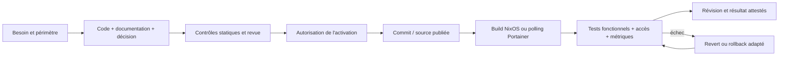

# GitOps et gestion des changements

## 1. Deux plans, deux modes d'activation

| Plan | Source | Activation | Appropriation |
| --- | --- | --- | --- |
| Infrastructure | Dépôt public NixOS, flake.lock | Build, test, switch privilégié autorisé | sobek |
| Applications | Dépôt privé homelab-apps | Portainer GitOps, polling configuré | sobek |
| État applicatif | Volumes / secrets / identités | Initialisation ou migration spécifique | sobek |
| Politique externe | Tailscale, GitHub, Discord | Consoles/services concernés | sobek |

Le polling de 15 minutes est documenté pour uptime-kuma-gitops ; vérifier
le réglage réel de chaque stack, pas supposer qu'il est universel.
NixOS n'active pas automatiquement chaque commit GitHub.



Pour une stack suivie sur main, pousser peut provoquer un redéploiement : la
publication fonctionnelle doit donc être précédée de l'autorisation prévue.
Les modifications de documentation seules n'autorisent ni rebuild ni reboot.

## 2. Avant un changement

1. Définir le besoin, les composants affectés, le risque et le test de succès.
2. Figer le commit de départ, les images et, pour NixOS, la génération.
3. Vérifier l'absence de changements utilisateur non committés.
4. Mettre à jour docs et décision ; contrôler les secrets sans publier les sorties.
5. Préparer rollback, fenêtre et accès de repli.
6. Pour une migration de données, vérifier la compatibilité du retour arrière.

Pas de secrets dans les paramètres de commandes, les fichiers exemples, les
diffs ou les preuves. Un PAT GitHub de lecture du dépôt applicatif peut être
conservé par Portainer ; son volume est alors sensible.

## 3. Contrôles infrastructure

Depuis /etc/nixos, avec le compte non privilégié :

```sh
git status --short
git diff --check
git diff
nix eval --raw .#nixosConfigurations.homelab.config.system.build.toplevel.drvPath
nix build .#nixosConfigurations.homelab.config.system.build.toplevel --no-link
```

Puis seulement après autorisation :

```sh
sudo nixos-rebuild test --flake .#homelab
# Vérifier une seconde session SSH et les services concernés.
sudo nixos-rebuild switch --flake .#homelab
```

test active déjà les services ; ce n'est pas un dry-run. switch met aussi à
jour l'état de démarrage. Les fichiers neufs doivent être ajoutés à Git pour
être visibles à une flake Git ; cela ne nécessite pas encore un commit.
Ne pas activer une autre révision entre le test et le switch.

## 4. Contrôles applications

Depuis un clone du dépôt privé :

```sh
git diff --check
docker compose -f apps/uptime-kuma/compose.yaml config --quiet
docker compose -f apps/netdata/compose.yaml config --quiet
```

Le lint vérifie le modèle Compose, pas l'existence des chemins sur l'hôte,
les permissions, le parseur Netdata ou la santé runtime.
Les règles Netdata ont aussi un test de parité offline et un retest API :
voir [SUPERVISION.md](SUPERVISION.md).

Dans Portainer : stack depuis Repository, branche main (ou référence explicite),
chemin apps/<service>/compose.yaml, accès Git limité, polling sans webhook public.
Après activation, comparer le commit récupéré, les images, les volumes stables,
l'absence de nouveaux ports et les tests de bout en bout.

## 5. Configurations et chemins Portainer

Utiliser configs.content pour les petits fichiers non sensibles embarqués.
Les dollars Netdata sont échappés par $$ dans le YAML.
configs.file peut devenir un bind sur un chemin interne /data/compose/...
absent de l'hôte Docker : ce fut l'échec corrigé au commit applicatif 768f95f.
Ne pas créer un répertoire factice ni élargir un montage pour masquer l'erreur.
Un bind absolu désigne l'hôte du démon Docker, pas le poste ou le conteneur UI.

Les secrets restent administrés sur l'hôte ou dans l'état applicatif existant,
jamais dans configs.content. Garder create_host_path: false pour le bind secret
Netdata afin d'échouer clairement si le fichier requis est absent.

## 6. Dérive et rollback

- Ne pas modifier durablement un Compose dans l'éditeur Portainer.
- En urgence : consigner toute modification locale puis la réconcilier dans Git.
- Hôte : génération précédente + investigation, puis correction/revert Git.
- Application : git revert du changement, publication autorisée, redéploiement
  du même stack avec les mêmes volumes. Pas de git reset --hard.
- Migration de base : une ancienne image peut être incompatible avec le nouveau
  format ; suivre la procédure spécifique, pas supposer le rollback suffisant.
- Ne jamais supprimer les volumes pour « repartir proprement ».

L'identité d'un déploiement associe commit infrastructure, génération NixOS,
commit applicatif réellement récupéré, digests et résultats fonctionnels.
Git propre et origin/main à jour ne suffisent pas à prouver cette identité.

Références : [configuration Compose](https://docs.docker.com/reference/compose-file/configs/),
[interpolation](https://docs.docker.com/reference/compose-file/interpolation/).
