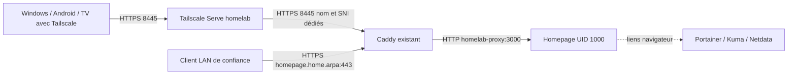

# Homepage : point d'entrée privé du lab

Statut au 2026-10-01 : proposition préparée sur branches de revue, pas encore
activée ni attestée en fonctionnement. Activation Docker/pare-feu et rebuild
soumis à l'autorisation explicite de l'opérateur. Le guide applicatif détaillé
est `apps/homepage/README.md` dans le dépôt privé `homelab-apps`.

## Architecture



Homepage apporte des liens, pas un plan de contrôle. Les contrôles d'accès de
Portainer et Kuma restent indépendants. La passerelle privacy-gateway, Mullvad,
AdGuard et le routage des clients ne sont pas modifiés. Homepage n'est pas une
preuve de bon fonctionnement du VPN ou de disponibilité des autres services.

## Répartition des sources

| Élément | Source | Activation |
| --- | --- | --- |
| Homepage, liens et paramètres | homelab-apps/apps/homepage/compose.yaml | Portainer GitOps |
| Listener HTTPS Caddy 8445 et vhost LAN | homelab-apps/apps/uptime-kuma/compose.yaml | Mise à jour de la stack existante |
| Serve 8445, mapping hôte, entrée tailscale0 | modules/tailscale.nix | NixOS test puis switch |
| DNS LAN et confiance CA Caddy | Configuration de chaque client / DNS LAN | Opérateur |

Tailscale : `https://homelab.tail239aaa.ts.net:8445/` avec certificat du tailnet.
LAN : `https://homepage.home.arpa/` avec CA Caddy déjà utilisée par le lab.
La publication Docker est liée uniquement à `192.168.1.69:8445`. Le filtre
DOCKER-USER existant reste inchangé. Aucun port hôte 3000, WAN ou Funnel.
Le relais local utilise le certificat interne sans vérifier sa chaîne, comme
les relais existants ; ce compromis reste limité à ce backend LAN fixe.

## Activation coordonnée — après approbation

Fusionner les branches Homepage des deux dépôts, puis sur le serveur :

```sh
cd /etc/nixos
git status --short
git pull --ff-only
sudo nixos-rebuild test --flake .#homelab
systemctl status tailscale-homepage-serve.service --no-pager
tailscale serve status
```

Créer la stack **homepage** dans Portainer depuis le dépôt privé, référence
`refs/heads/main`, fichier `apps/homepage/compose.yaml`, polling 15 minutes,
accès administrateurs seulement. Mettre à jour la stack Kuma/Caddy existante
depuis Git ; ne pas recréer Kuma et ne pas supprimer ses volumes. Un bref arrêt
de Caddy pendant sa recréation peut toucher les autres interfaces.

## Recette et critères de succès

1. Le conteneur Homepage est healthy, sans restart loop ni erreur YAML/EACCES.
2. Depuis Windows connecté à Tailscale, l'URL 8445 charge le portail, pas Kuma.
3. Les liens Portainer, Kuma et Netdata chargent leurs interfaces habituelles.
4. Au retour sur le LAN, nom et certificat Caddy sont correctement résolus et
   reconnus ; les liens LAN fonctionnent sans Tailscale.
5. Vérifier que les listeners existants et privacy-gateway sont inchangés.
6. Seulement ensuite : `sudo nixos-rebuild switch --flake .#homelab`.

La validation `docker compose config --quiet` prouve la syntaxe Compose, pas le
succès des montages tmpfs/configs, le fonctionnement de l'image ni les accès.
Ne pas déclarer l'ensemble déployé avant cette recette. Un test d'accès WAN
requiert une cible et une origine explicitement autorisées, pas un scan improvisé.

## Sécurité, maintenance et rollback

Allowed-hosts strict n'est pas une authentification. La première proposition
est un portail de liens sans secret, accessible au LAN de confiance et au
tailnet selon sa politique d'accès. Si le LAN n'est pas fiable, activer une
authentification applicative avec secrets runtime avant le déploiement.
Pas de socket Docker ni clé API. Le bridge partagé donne accès aux backends et
n'est pas un filtre de sortie Internet. Les mises à jour restent revues avec
tag/digest épinglés ; pas d'auto-update aveugle.

Revert des commits applicatifs puis redéploiement de la stack concernée ;
rollback NixOS si nécessaire. Ne jamais `tailscale serve reset`, qui toucherait
les trois autres interfaces. Aucune donnée métier Homepage : Git suffit pour
ses paramètres, les logs/cache sont éphémères. La CA Caddy reste un état
persistant existant à préserver.
