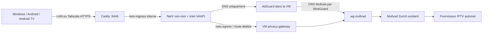

# NetV : lecture privée, sortie Mullvad obligatoire

Statut : **préparé sur branche, pas encore activé ni testé en lecture IPTV**.
Le compte IPTV et le compte administrateur NetV sont saisis par le propriétaire
dans l'interface HTTPS, jamais dans Git ou dans une conversation.

Le flux fournisseur est récupéré par NetV, puis relayé au client par HTTPS.
Les clients n'ont pas besoin de sélectionner l'exit node pour regarder NetV :
leur connexion Tailscale suffit à joindre le service privé. Le navigateur n'a
pas le droit de charger des médias ou d'ouvrir des connexions vers le fournisseur
directement (CSP Caddy). Garder le mode NetV `always`, jamais `auto` ou `never`.
La CSP bloque un mode direct mal configuré ; elle ne le convertit pas en relais.

## Contrat réseau

| Réseau | Hôte | VM / application | Usage |
| --- | --- | --- | --- |
| `br-pgw`, 172.30.242.0/30 | .1 | VM .2 / `uplink0` | Sous-couche WireGuard uniquement |
| `netv-egress`, 172.30.240.0/28 | .1 | VM .2 / `apps0`, NetV .10 | Flux vers la VM et DNS AdGuard |
| `netv-ingress`, 172.30.241.0/28 | bridge Docker interne | Caddy et NetV | Entrée HTTP privée, sans sortie Internet |

Deux TAP persistants, appartenant à l'utilisateur système de la VM, remplacent
SLiRP : `pgw-uplink` et `pgw-netv`. Interfaces invitées identifiées par MAC.
La règle IPv4 4900/table 203 ne concerne que 172.30.240.10. La route par défaut
de l'hôte et les réseaux des autres applications ne changent pas.

Défenses complémentaires :

- IPv6 désactivé sur les réseaux applicatifs ; aucun défaut IPv6 hors VPN.
- Aucun masquerading Docker sur `netv-egress` ; NAT applicatif uniquement dans
  WireGuard, avec filtrage hôte empêchant un repli vers le WAN.
- La VM ne peut sortir par son underlay que vers l'endpoint Mullvad existant,
  en UDP 51820. Son interface applicative n'expose que DNS à NetV.
- NetV ne joint pas les réseaux LAN/tailnet/privés, sauf son DNS dédié.
- Pas de socket Docker, pas de `privileged`, pas de NET_ADMIN dans NetV.
- Entrée HTTPS LAN `https://netv.home.arpa/`, Tailscale
  `https://homelab.tail239aaa.ts.net:8446/`. Aucun Funnel ni ouverture routeur.
- Le bootstrap SSH `127.0.0.1:2222` est conservé par un relais local restreint.

## Runtime et données

Image épinglée au digest OCI ; révision amont
`7a0537251716ab07a2da3860aba4316bfac41830`. Le tag registry `v0.3.0`
n'existait pas lors de la préparation ; ne pas confondre release et image.
NetV tourne en UID/GID 10001, rootfs en lecture seule, capacités supprimées,
2 CPU, 1,5 Gio de mémoire et 192 processus maximum. Un initializer sans réseau
prépare uniquement le volume `netv-state` et ne remplace jamais les paramètres
existants. Le volume contient les identifiants fournisseur, comptes et secret
de session : données sensibles, hors Git, à protéger dans les futures sauvegardes.

Seul `/dev/dri/renderD128` (Intel) est exposé ; pas de NVIDIA, pas d'upscaling IA.
VAAPI est un choix initial **à valider par une lecture réelle**, pas une garantie
d'encodage matériel. Relayer/remuxer les codecs compatibles est préférable à un
réencodage ; vérifier le comportement de l'image et les codecs source avant
d'augmenter le nombre de sessions. Le cache temporaire est borné à 768 Mio.

Les erreurs amont peuvent contenir des URL avec identifiants. Le stdout NetV
n'est donc pas conservé, et Caddy n'active pas les access logs. Cette exception
limite le diagnostic : santé Docker, ressources Netdata et mesures réseau
restent disponibles ; ne pas activer des logs debug en production avec un
abonnement enregistré. L'authentification applicative reste obligatoire.

## Déploiement ordonné

1. Garder une session SSH hôte ouverte, désélectionner temporairement l'exit node
   sur le poste d'administration. Ne pas détruire le disque QCOW2 ou les secrets.
2. Construire cette branche, relire le diff et lancer le script
   `scripts/netv-deploy-test.sh` avec sudo. L'activation `test` ne persiste pas
   la génération de démarrage ; le script revient à la génération précédente
   si l'activation ou les vérifications locales échouent.
3. Vérifier depuis le poste le bootstrap SSH invité, le handshake WireGuard,
   DNS AdGuard, l'accès Internet via exit node et l'accès SSH hôte.
4. Dans Portainer, créer `netv-gitops`, dépôt `homelab-apps`, référence
   `refs/heads/codex/netv`, chemin `apps/netv/compose.yaml`. Pas d'additional
   paths ; authentification Git limitée à Contents read si dépôt privé.
5. Mettre à jour le stack Caddy/Kuma avec la même branche et son chemin habituel.
   **Créer les réseaux hôte avant cette mise à jour**. Homepage vient après.
6. Ouvrir NetV et créer immédiatement le compte administrateur. Ajouter soi-même
   les sources d'un abonnement autorisé. Aucun identifiant n'est nécessaire à
   la recette réseau initiale. Ne pas publier le gateway Xtream 8100.
7. Exécuter la recette ci-dessous. Fusionner/persister seulement après succès,
   puis remettre les stacks GitOps sur `refs/heads/main`.

## Recette avant switch

- Les services `netv-private-network`, `privacy-gateway-vm` et le relais SSH sont
  actifs ; règle 4900 et table 203 pointent vers la VM.
- Depuis le conteneur NetV, vérifier la résolution DNS, la réponse du service
  public de vérification Mullvad et l'absence de route IPv6 de secours.
- Avec WireGuard arrêté temporairement **dans la VM**, une connexion neuve
  NetV vers une IP publique connue doit échouer, sans DNS ni route de secours.
  Rétablir le tunnel immédiatement ; refaire les tests de sortie. Cette recette
  interrompt aussi les clients utilisant la VM comme exit node.
- Avec la VM arrêtée, même résultat ; santé hôte et autres services inchangée.
- Vérifier les réponses HTTPS, cookie de session et CSP via LAN et tailnet.
  Vérifier les requêtes du lecteur : aucune requête au fournisseur depuis le client.
- Lire une chaîne 15 minutes, puis une VOD ; comparer débit utile, pertes,
  CPU/RAM/GPU et latence. Tester Windows, Android puis TV.
- Après redémarrage Docker et de la VM, confirmer les TAP, routes et règles.
  Ne pas déclarer une robustesse au reboot hôte tant qu'il n'a pas été testé.

Les tests de coupure sont à conduire avant de saisir des identifiants IPTV.
Ne pas imprimer `server_settings.json`, les URL sources, les clés ou les cookies.

## Retour arrière

Avant mise à jour Caddy : activer l'ancien `switch-to-configuration test`.
Après mise à jour : arrêter NetV dans Portainer, revenir Caddy et Homepage aux
commits précédents, puis activer la génération précédente. Le vieux QEMU utilise
SLiRP et reprend le port 2222 lorsque le relais de cette branche est arrêté.
Les réseaux privés et règles de routage résiduels n'offrent pas de sortie NetV ;
les nettoyer uniquement après vérification des endpoints, sans supprimer le
volume applicatif, la clé Mullvad ni le disque invité.

## Limites

Le débit dépend encore du Wi-Fi hôte, de l'upload domestique pour les clients
distants, du chemin Tailscale direct/DERP, de Mullvad et du fournisseur. Un câble
Ethernet reste l'amélioration physique prioritaire. Aucune garantie de bypass
universel, d'anonymat ou de disponibilité fournisseur ; respecter les droits
de diffusion et la réglementation applicable. Les ACL Tailscale externes et
la télévision encore inscrite dans l'ancien tailnet restent des étapes séparées.

Sources : [NetV](https://github.com/jvdillon/netv),
[QEMU networking](https://www.qemu.org/docs/master/system/devices/net.html),
[Docker bridge](https://docs.docker.com/engine/network/drivers/bridge/),
[Tailscale performance](https://tailscale.com/docs/reference/best-practices/performance).
