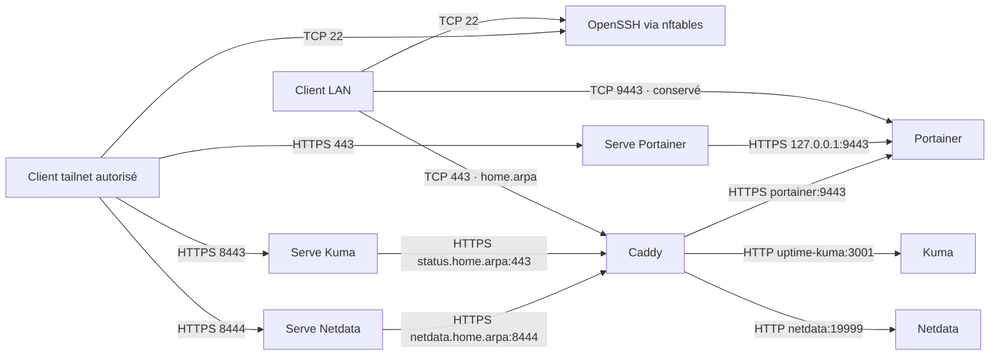

# Réseau, DNS et TLS

## 1. Contrat

Administration uniquement LAN et tailnet. Pas d'entrée Internet publique
intentionnelle ; des sorties GitHub, registres, Tailscale et Discord existent.
Routeur, UPnP, IPv6 et ACL tailnet sont externes au code : ne pas les supposer sûrs.

## 2. Chemins déclarés

Le filtrage des ports Docker publiés n'est pas le chemin INPUT de SSH/Serve.

## 3. Annuaire

| Service | LAN | Tailscale |
| --- | --- | --- |
| SSH | ssh sobek@192.168.1.69 | ssh sobek@100.120.235.24 ou homelab via MagicDNS |
| Portainer | https://portainer.home.arpa | https://homelab.tail239aaa.ts.net/ |
| Portainer direct | https://192.168.1.69:9443 | Non prévu directement |
| Kuma | https://status.home.arpa | https://homelab.tail239aaa.ts.net:8443/ |
| Netdata | https://netdata.home.arpa | https://homelab.tail239aaa.ts.net:8444/ |

LAN : 192.168.1.0/24 ; hôte : 192.168.1.69. Ces adresses décrivent
l'installation, pas une extension de l'autorisation de scan.
SSH exige une clé et une empreinte hôte vérifiée. Portainer/Kuma ont leurs
comptes applicatifs. Vérifier le mode d'identité Netdata ; ne pas en inventer un.

Les noms home.arpa doivent résoudre vers l'hôte sur les clients LAN ; leur DNS
client n'est pas provisionné ici. NixOS fournit seulement les mappings
status.home.arpa et netdata.home.arpa côté serveur pour le SNI des backends Serve.
Ne pas confondre Host HTTP et SNI TLS.

## 4. Flux autorisés par conception

| Source | Destination | Usage | Limite |
| --- | --- | --- | --- |
| LAN IPv4 | Hôte 22 | SSH | Source LAN, clé, AllowUsers |
| tailscale0 | Hôte 22,443,8443,8444 | Administration | nftables + ACL tailnet externe |
| LAN IPv4 | Docker 443,9443,8444 | HTTPS | DOCKER-USER ; Caddy lié à l'IP LAN |
| Caddy | Portainer 9443 / Netdata 19999 | Proxy | Bridge partagé homelab-proxy |
| Caddy | Kuma 3001 | Proxy | uptime-kuma-net interne |
| Kuma | Caddy 443 /health/* | Sondes | Chemin interne, pas test distant |
| Kuma | DNS / Discord HTTPS | Notifications | Bridge NAT kuma-egress |
| Netdata | Discord HTTPS | Alertes | Bridge homelab-proxy |
| Portainer / hôte | GitHub / registres | Déploiement | Sorties, identifiants si requis |

Les bridges partagés ne font pas de microsegmentation par service.
kuma-egress n'est pas une allowlist Discord : autres sorties possibles si l'hôte
les permet. Le réseau interne de Kuma ne neutralise pas son autre bridge NAT.

## 5. Garde Docker

Ports globalement autorisés vides dans le firewall NixOS. Les publications
Docker après DNAT traversent FORWARD : INPUT fermé ne suffit pas.
docker-lan-guard accroche HOMELAB-DOCKER-GUARD à DOCKER-USER.

Ordre IPv4 : established/related, loopback, docker0, bridges br-+, source LAN,
DROP. IPv6 : exceptions internes puis DROP, sans LAN IPv6 autorisé.
La garde IPv6 est installée seulement si DOCKER-USER IPv6 existe.
Retester après changement de backend Docker ; la garde n'est pas un filtrage
de toutes les sorties par destination.

## 6. TLS et exceptions

| Segment | Confiance actuelle |
| --- | --- |
| Client LAN → Caddy | CA interne ; racine à importer après vérification hors bande |
| Client tailnet → Serve | Certificat du nom Tailscale ; validation côté client |
| Serve → backend HTTPS | https+insecure : certificat backend non vérifié |
| Caddy → Portainer | tls_insecure_skip_verify : auto-signé non vérifié |
| Caddy → Kuma / Netdata | HTTP sur bridge ; pas TLS applicatif |
| Kuma → /health/* Caddy | Exception TLS pour les sondes internes uniquement |

TLS valide en façade n'est pas TLS vérifié de bout en bout. Retirer 9443 ne
supprime pas automatiquement l'exception Caddy → Portainer. Ne jamais importer
une racine récupérée sur un canal non authentifié ni partager sa clé privée.
Le vhost interne caddy n'est pas une URL cliente prévue ; il ne bénéficie pas
d'un contrôle d'origine distinct déclaré. Voir [STATUS.md](STATUS.md).

## 7. Contrôles

Exception explicitement ajoutée au 2026-10-01 : exit node `privacy-gateway`,
100.116.220.6, VM séparée. Il sert la sortie Internet de clients volontaires,
pas la réparation d'une URL d'administration. DNS privé TCP/UDP 53 et SSH
TCP 22 sur tailscale0 ; AdGuard UI loopback 3000 ; bootstrap SSH hôte loopback
2222 vers invité 22. Aucun port LAN/public n'est ajouté pour cette VM.
Le transit Tailscale vers Internet est NATé exclusivement sur wg-mullvad ;
le transit vers réseaux privés est refusé. Exceptions uplink invité : DHCP,
endpoint Mullvad UDP/51820 et réponse SSH bootstrap vers 10.0.2.2 uniquement.
La politique Tailscale externe demeure une source de vérité hors Git.

Tester chaque point depuis LAN puis tailnet autorisé. Les refus depuis une
autre origine exigent une cible de test explicitement autorisée. Pas de Funnel,
route annoncée, exit node ou redirection routeur à ajouter pour réparer un accès.
Diagnostic : [RUNBOOKS.md](RUNBOOKS.md).

Références : [Docker et pare-feu](https://docs.docker.com/engine/network/packet-filtering-firewalls/),
[Tailscale Serve](https://tailscale.com/docs/reference/tailscale-cli/serve).
