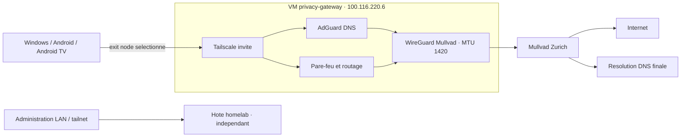

# Déploiement progressif de la passerelle privée

## État au 2026-10-01

VM compilée sur le homelab, avec ses dépendances NixOS verrouillées.
L'évaluation de la configuration invitée et de l'intégration hôte réussit.
La configuration hôte complète compile également, notamment SSH et systemd.
La configuration a été validée en `test`, puis persistée par switch propriétaire.
Les générations active et persistée sont identiques au dernier contrôle SSH.
Les tests DNS, IPv4, IPv6 et coupure/restauration VPN de l'invité passent.
SSH et DNS depuis Windows via Tailscale sont vérifiés. Les corrections de
démarrage, de DNS et de routage sont activées et vérifiées après redémarrage.
La recette Windows via exit node passe en IPv4/IPv6 ; la coupure Mullvad bloque
les nouvelles connexions testées. Le correctif de débit MTU Mullvad 1420 est
compilé et testé au runtime, mais attend son activation test. Voir
PRIVACY_GATEWAY_VALIDATION.md pour les mesures et les limites.

## Ressources et isolation

## Chemins réseau



Vue logique des données clients. Le transport chiffré extérieur de Tailscale
de cette VM passe lui aussi par Mullvad. Aucun bypass physique Tailscale n'a
été ajouté. tailscale0 reste à MTU 1280 ; wg-mullvad est à 1420 et eth0 à 1500.
La clé privée n'apparaît pas dans le schéma ni les sources.
AdGuard est un relais sans blocklist pour l'instant, avec historique DNS
et statistiques désactivés. Le DNS privé/DoH d'une application peut éviter
AdGuard : voir [guide clients](PRIVACY_GATEWAY_CLIENTS.md).

### Isolation et ressources

- QEMU/KVM : 2 vCPU, 2 Gio de RAM, disque persistant 8 Gio.
- Compte système hôte `privacy-gateway-vm`, sans sudo, sans socket Docker.
- Réseau utilisateur QEMU : pas de bridge LAN, TAP ou route ajoutée sur l'hôte.
- SSH invité publié seulement sur `127.0.0.1:2222` de l'hôte.
- Une exception SSH pour `sobek` autorise uniquement la redirection locale vers
  ce port. Aucun forwarding arbitraire, agent SSH ou port public n'est autorisé.
- Le compte `gateway-admin` de l'invité utilise la clé publique administrative
  existante. Il dispose de sudo sans mot de passe dans cet invité uniquement.
- L'invité n'a pas accès au Nix store complet de l'hôte : image de sa closure
  dédiée, et unique partage 9p explicite de credential en lecture seule.
- La clé est saisie par le propriétaire dans un fichier hôte root:root 0600.
  systemd LoadCredential la remet au processus QEMU ; l'invité en installe une
  copie runtime root:root 0600, sans contenu dans les logs ou le Nix store.
- L'arrêt passe par ACPI/QMP avec une fenêtre de 80 s avant terminaison forcée.

Le propriétaire a autorisé les changements de ce chantier. Cela ne vaut pas
preuve d'isolation, de kill switch ou de bon fonctionnement : tests obligatoires.
Le port bootstrap reste ouvert uniquement sur loopback tant que nécessaire à
la récupération ; son retrait se fait après validation de l'accès Tailscale.

## Deux commandes propriétaire sur homelab

Les scripts publics sont déposés sous `/home/sobek/privacy-gateway-staging`.
La première commande demande **seulement la valeur** PrivateKey, saisie masquée :

```bash
sudo bash /home/sobek/privacy-gateway-staging/provision-key.sh
sudo bash /home/sobek/privacy-gateway-staging/deploy-test.sh
```

Ne pas coller le profil entier. Ne pas envoyer la clé dans le chat ni dans une
commande CLI. La première commande préserve un fichier existant correctement
protégé. La seconde refuse un dépôt sale, garde un backup et lance seulement
`nixos-rebuild test`. Les sources modifiées sont indexées pour les flakes,
pas committées ni poussées. Garder la session SSH ouverte pendant la recette.

## Vérifications après activation test

Depuis Windows, après validation de l'identité SSH de l'invité :

```powershell
ssh -J sobek@homelab -p 2222 gateway-admin@127.0.0.1
```

Avant de saisir une approbation SSH, comparer l'empreinte publique publiée par
`privacy-gateway-identity` sur la console, relayée dans les logs de la VM hôte
(`sudo journalctl -u privacy-gateway-vm.service --no-pager`) ; ne pas désactiver
StrictHostKeyChecking. La vérification d'identité doit précéder l'administration.

Dans l'invité :

```bash
systemctl --failed
sudo wg show wg-mullvad latest-handshakes
dig @127.0.0.1 example.com
curl --fail --max-time 15 https://am.i.mullvad.net/json
sudo tailscale up --accept-dns=false --accept-routes=false --netfilter-mode=off --advertise-exit-node
```

L'authentification Tailscale et l'approbation de la sortie nécessitent une
action du propriétaire dans sa console. Tester ensuite IPv4/IPv6/DNS depuis
un client pilote, arrêter WireGuard pour prouver le refus d'Internet, le relancer
et vérifier le retour. Vérifier aussi accès administratif LAN/Tailscale du lab.
Ne pas arrêter le tunnel de l'hôte : tous les tests concernent l'invité.

La configuration DNS Tailscale et les politiques client ne sont pas encore
appliquées. Android/TV non gérés ne garantissent pas une sélection obligatoire
de la sortie à chaque connexion. Ne pas confondre ce choix avec un verrouillage.

## Persistance et retour arrière

Après activation `test` de la génération `dw1g960133js7dar8lck17irv13nvxnj`,
MTU 1420, fwmark 51820, resolv.conf vers AdGuard et IPv4/IPv6 Mullvad sont
revenus sans intervention. Aucun service invité en échec. Le switch propriétaire
suivant a aligné génération active et persistée, vérifié par SSH. Un commit/push
n'effectue ni switch ni reboot. Le reboot complet de l'hôte reste non testé.

L'inscription de `privacy-gateway.tail239aaa.ts.net` est terminée (100.116.220.6).
Les routes de sortie sont approuvées dans Tailscale et la sélection Windows
a été testée. L'identité `homelab` existante reste indépendante.

Uniquement après recette réussie : `sudo nixos-rebuild switch --flake /etc/nixos#homelab`.
Documenter la décision et le résultat avant commit/push.
En cas d'échec : ne pas répéter aveuglément le script de déploiement.

L'état antérieur est conservé dans `/var/lib/privacy-gateway-deploy`.
Le chemin de génération précédente est dans `previous-system` ; sa commande
`bin/switch-to-configuration test` restaure les services précédents après arrêt
de `privacy-gateway-vm.service`. Restaurer également l'import et désindexer
uniquement les fichiers de cette livraison. La flake précédente est dans
`flake.before`. Conserver le disque pour diagnostic ;
ne pas supprimer la clé ou les données implicitement lors du rollback.

Un rollback de configuration ne supprime pas les utilisateurs déjà créés,
les credentials ou les fichiers de disque. Leur éventuel retrait doit être
explicite. Les sauvegardes/restaurations restent reportées par le propriétaire.

## Sources de vérité

L'infrastructure invitée est versionnée dans le dépôt NixOS, sous
`hosts/privacy-gateway`, et son superviseur dans `modules/privacy-gateway-vm.nix`.
La flake construit directement `nixosConfigurations.privacy-gateway` avec son
nixpkgs verrouillé ; l'hôte référence cette construction, pas un artefact externe
ni une évaluation `--impure`. Les fichiers privés préparatoires sont une copie
de travail : ne pas les maintenir comme deuxième source indépendante.
