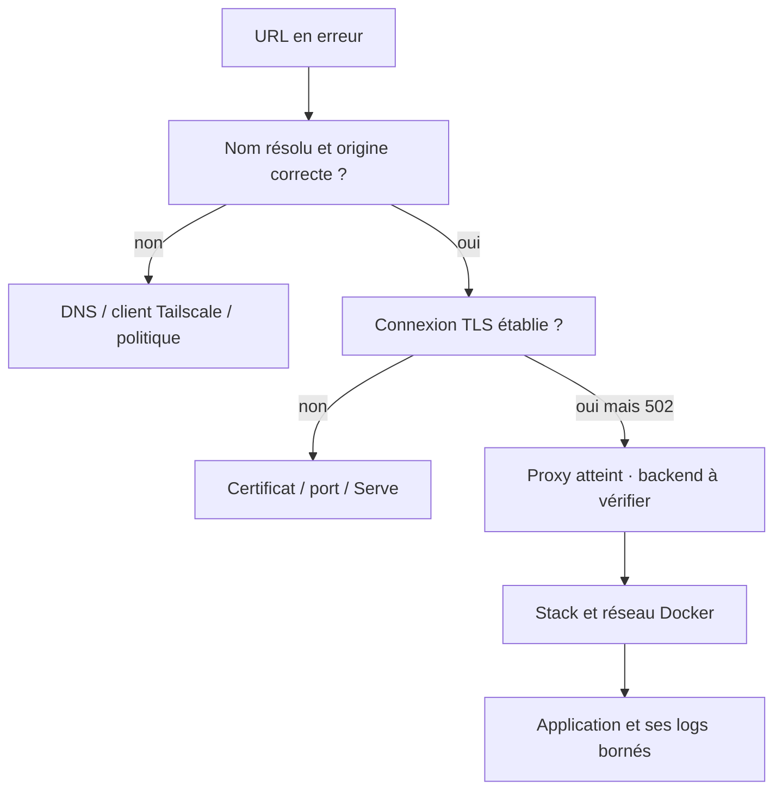

# Runbooks · diagnostic et récupération

## Mode d'emploi

Commencer par l'heure, l'URL exacte, l'origine LAN/tailnet et le dernier
changement. Collecter seulement l'état pertinent, sans secrets. Les lectures
ordinaires sont privilégiées ; les commandes root et actions correctrices
demandent l'autorisation applicable. Ne pas ouvrir un port, enlever la garde,
désactiver TLS côté client ou supprimer un volume pour contourner une panne.

## RB-01 · HTTPS inaccessible / 502

1. Comparer l'URL avec [NETWORK.md](NETWORK.md). Hors domicile, une IP LAN
   n'est pas atteignable sans route explicitement configurée ; utiliser Serve.
2. Sur Windows : Resolve-DnsName du nom attendu ; vérifier Tailscale connecté.
3. Sur l'hôte : tailscale serve status et état de l'unité Serve concernée.
4. Dans Portainer : état Caddy et backend, réseaux et image du commit attendu.
5. Un HTTP 502 indique un proxy atteint mais un backend en échec ; il ne
   justifie pas l'ouverture de nouveaux ports.
6. Une erreur SNI nécessite le nom backend correct. Une redirection de 8444
   vers Kuma : contrôler le relais Netdata vers netdata.home.arpa:8444,
   distinct de Kuma vers status.home.arpa:443.

Succès : bonne application, TLS client valide, réponse utile, pas seulement TCP.
Voir modules/tailscale.nix et le Caddyfile applicatif. Ne pas faire confiance
à active (exited) comme unique preuve.

## RB-02 · Conteneur Restarting / échec de stack

1. Lire le message Portainer, la référence Git et le nom réel du conteneur.
   Un stack peut préfixer le nom : ne pas supposer un conteneur nommé netdata.
2. Examiner les logs de ce conteneur dans une fenêtre courte, sans debug secret.
3. Vérifier config inline, volumes stables, chemin absolu hôte et permissions.
4. « bind source path does not exist: /data/compose/... » : chemin Portainer
   utilisé comme chemin hôte. Corriger la source Git (configs.content pour
   fichier non sensible), pas créer un faux chemin ni supprimer les volumes.
5. Erreur sur /var/lib/homelab-secrets : seul l'opérateur vérifie existence et
   permissions ; personne ne doit afficher/copier le contenu.
6. Après correction autorisée : Pull and redeploy du même stack, puis retest.

Succès : absence de boucle de restart, image attendue et réponse applicative.
Un lint Compose réussi seul ne clôture pas l'incident.

## RB-03 · Kuma rouge alors que le navigateur fonctionne

La sonde s'exécute depuis le conteneur, pas depuis le navigateur.
Un nom MagicDNS peut ne pas résoudre dans son réseau Docker.

Utiliser les endpoints existants :
https://caddy/health/kuma, https://caddy/health/portainer,
https://caddy/health/netdata. Type HTTP(s), GET, codes 200–299, pas d'en-tête
Host personnalisé. Exception certificat limitée à ce backend interne ;
désactiver les notifications d'expiration de domaine pour le nom Docker caddy.

Un check vert atteste ce chemin interne, pas l'accès tailnet de bout en bout.
Ne pas monter le socket Docker ou mettre Kuma en réseau host pour réparer DNS.

## RB-04 · Discord échoue

| Erreur | Examiner | Ne pas faire |
| --- | --- | --- |
| ENOTFOUND discord.com | DNS, bridge de sortie Kuma, DNS hôte | Remplacer par IP ou désactiver TLS |
| Unknown Channel / code 10003 | Salon du webhook et type thread/forum | Changer le firewall |
| thread_id vide | Sélection salon normal vs thread et ID valide | Ajouter un ID arbitraire |
| 401/404 | Révocation ou URL incorrecte côté propriétaire | Publier l'URL pour diagnostic |
| Timeout / 429 | Réseau, fournisseur, débit d'alertes | Boucle de tests ou spam |

Kuma conserve le webhook dans son volume ; Netdata lit le fragment shell root
au point secret. Pas de NETDATA_ALARM_NOTIFY_DEBUG ni de sortie brute partagée.
Tout test notification envoie un vrai message ; annoncer/autoriser sa portée.
Succès : message dans le bon salon, retour à la normale reçu, secret non exposé.

## RB-05 · Alerte ressource ou service Netdata

1. Vérifier fraîcheur, graphique, dimension et règle chargée.
2. CPU : build Nix/workload actif, processus et durée ; pas seulement pic.
3. RAM : MemAvailable et PSI, OOM ; le cache n'est pas une panne.
4. Disque : racine, EFI et inodes ; logs, store Nix et volumes séparément.
5. Service : état systemd et journal de l'unité ; distinguer oneshot maintenu
   actif et démon, métriques absentes et service réellement arrêté.
6. Retester après correction, vérifier hystérésis et notification de retour.

Pas de saturation artificielle, reboot automatique, suppression de données ou
docker system prune --volumes. Un service Netdata/Docker arrêté peut empêcher
sa propre alerte : la couverture externe est une limite documentée.

## RB-06 · SSH / boot / PCRLock

Conserver la session ouverte lors d'un changement. Pour perte distante :
vérifier client Tailscale, nom, ACL et état serveur ; repli LAN/console.
Ne pas activer l'authentification par mot de passe ni les tunnels comme dépannage.

Après switch : lire les messages PCRLock. Un PCR retiré du masque ne doit pas
être silencieusement annoncé comme protégé. Opérateur : vérifier Secure Boot
et cryptroot, puis comparer au code. Pas de réenrôlement TPM, suppression de
slots ou flash firmware sans plan de récupération et autorisation distincte.
Reboot seulement si une personne peut déverrouiller le disque.

## RB-07 · Rapport d'audit non concluant

Respecter security/scope.yml et ROE. Ne pas élargir une cible pour terminer.
vulnix exit 2 est non concluant, pas une CVE validée. Une découverte locale
depuis le serveur ne prouve pas l'exposition depuis Windows. Conserver commit,
génération, outil, date et périmètre. Retester uniquement les contrôles affectés
après revue du correctif ; ne pas modifier un rapport initial figé.

## Clôture d'incident

Noter impact utilisateur, chronologie, cause établie, correction, contrôle de
succès, risques restants et propriétaire. Séparer fait et hypothèse.
Ne pas qualifier une panne « corrigée » sur la seule présence d'un commit.
