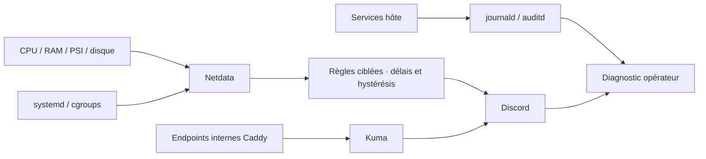

# Observabilité et alerting

## 1. Modèle

| Outil | Question | Source | Limite |
| --- | --- | --- | --- |
| Kuma | L'endpoint répond-il ? | Sondes HTTP internes configurées dans l'UI | Pas une sonde tailnet externe |
| Netdata | Pourquoi le système se dégrade-t-il ? | Hôte, processus, systemd, cgroups | Collecte locale, noms Docker par hash |
| Portainer | Quel conteneur/stack est déployé ? | Docker Engine | Interface privilégiée, pas un système métrique |
| journald/auditd | Que s'est-il passé ? | Événements locaux | Rétention bornée, pas d'export établi |
| Discord | Une action est-elle signalée ? | Notifications sortantes | Réception dépend du réseau/fournisseur |



La philosophie vise des signaux utiles et actionnables plutôt que « tout rouge
ou tout vert ». Latence, erreurs et disponibilité concernent Kuma ; saturation
et ressources concernent Netdata. Le trafic par application n'est pas entièrement
instrumenté. Pas de SLO/uptime contractuel ni d'astreinte 24/7 promis.

## 2. Accès et sondes

URLs : [NETWORK.md](NETWORK.md). Kuma et Netdata n'ont pas de port hôte direct.
Caddy appartient au stack uptime-kuma-gitops ; Netdata est une autre stack.
Les sondes utilisent https://caddy/health/kuma, /health/portainer, /health/netdata.
Elles utilisent les backends prévus sans Host personnalisé ; l'exception TLS
interne ne s'étend pas aux navigateurs. Voir [RUNBOOKS.md](RUNBOOKS.md).

## 3. Netdata déclaré

Collecte de base 1 seconde ; dbengine trois tiers :
14 jours / 1 GiB, 3 mois / 1 GiB, 1 an / 1 GiB. Durées objectifs et limites
souples : vérifier la rétention effective. Logs Netdata json-file : 3 × 10 Mo.
DISABLE_TELEMETRY et DO_NOT_TRACK déclarés ; ce n'est pas une désactivation
d'une identité Cloud déjà enregistrée.

Pas de socket Docker. Cgroups visibles par identifiant, pas inventaire complet,
noms ou compteurs de redémarrage garantis. Montages hôte et capacités Netdata
restent sensibles : [DATA.md](DATA.md), [STATUS.md](STATUS.md).

## 4. Jeu d'alertes versionné

Source détaillée : dépôt privé apps/netdata/ALERTING.md et health.d/homelab.conf.
17 règles homelab + deux règles natives sélectionnées. La configuration ferme
la liste aux homelab_*, oom_kill, 1hour_memory_hw_corrupted ; les autres règles
natives ne sont pas garanties chargées. Une intégration exige une revue.

| Signal | Warning | Critical | Fenêtre / délai notification |
| --- | --- | --- | --- |
| CPU | >90 % | >98 % | Moyenne 10 min ; délai 2 min |
| RAM disponible | <10 % | <5 % | MemAvailable ; délai 5 min |
| Racine | >85 % utilisé ou <15 GiB | >95 % ou <5 GiB | Délai 2 min |
| EFI | <200 MiB | <100 MiB | Délai 2 min |
| Inodes racine | <15 % libres | <5 % | Délai 2 min |
| PSI full mémoire | >5 % | >20 % | Moyenne noyau 5 min ; délai 2 min |
| PSI full I/O | >20 % | >50 % | Même fenêtre/délai |
| Dix unités essentielles | — | Aucun point active sur 2 min | Puis délai 30 s |
| OOM / corruption mémoire | Règles natives de l'image épinglée | Règles natives | Pas de test destructif |

Unités : docker, tailscaled, sshd, auditd, nftables, docker-lan-guard,
docker-portainer, tailscale-portainer-serve, tailscale-uptime-kuma-serve,
tailscale-netdata-serve. Certaines sont oneshot avec RemainAfterExit :
elles restent observables, mais leur état ne prouve pas le backend HTTP.

Hystérésis déclarée : CPU retour 85/95 %, RAM 15/8 %, racine 80/92 % et
20/8 GiB, EFI 250/150 MiB, inodes 20/8 %, PSI mémoire 3/15 %, PSI IO 10/30 %.
Retour notifié après 5 min pour ressources, 2 min pour services.
Pas de rappel warning ; rappel critical toutes les 4 h pour homelab_*.
delay retarde la notification, pas l'état affiché. Données absentes ≠ arrêt.

## 5. Validation et réception

La réception Discord WARNING/CRITICAL/CLEAR a été montrée par l'opérateur.
Cela valide la chaîne de notification testée, pas les 17 expressions et seuils.
Le correctif 768f95f embarque les règles dans configs.content après l'échec du
bind configs.file. Aucun retest runtime réussi du nouveau jeu n'est attesté
par cette revue documentaire.

Depuis le clone applicatif, PowerShell :

```powershell
./apps/netdata/Test-AlertCoverage.ps1 -Offline
./apps/netdata/Test-AlertCoverage.ps1 -RequireDeployed
```

Le premier compare copie inline et fichier canonique ; le second vérifie via
l'API privée les graphiques, règles attendues et états évalués. Ne pas prendre
un test offline pour une activation. Un test Discord réel requiert l'autorisation
appropriée ; aucun incident artificiel n'est nécessaire.

## 6. Lacunes et entretien

Pas de garantie actuelle pour SMART/NVMe, température, expiration TLS,
collecteurs absents, restart Docker individuel ou panne totale d'hôte.
Kuma et Netdata partagent l'hôte et dépendent du même réseau sortant :
une panne totale peut rester silencieuse. Sonde indépendante à décider,
pas installée par ce dossier.

Après changement de collecteur : vérifier points récents, dimensions et règles.
Après modification de seuils : documenter bruit observé, impact utilisateur et
fenêtre ; revoir après une période d'exploitation réelle.
L'absence d'alerte n'est jamais une preuve de bonne collecte.

Référence de méthode : [Google SRE · monitoring](https://sre.google/sre-book/monitoring-distributed-systems/).
