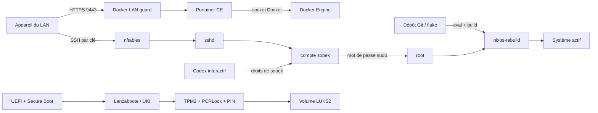

# Modèle de menaces

Ce document décrit l'état actuel du homelab et sert de point de départ à une
future revue de sécurité. Les scénarios ci-dessous sont des hypothèses à tester,
pas des vulnérabilités confirmées.

## 1. Vue d'ensemble

Le système est une machine NixOS personnelle administrée par le compte `sobek`.
La configuration déclarative vient de ce dépôt et devient active après
évaluation, construction puis `nixos-rebuild`. Le volume système est chiffré par
LUKS2. La chaîne Secure Boot/Lanzaboote mesure les PCR 0, 4 et 7 et le TPM2 exige
un PIN au démarrage. Une passphrase et une clé de récupération restent des voies
de secours conservées hors machine.

### Composants et preuves

| Composant | Rôle | Source |
| --- | --- | --- |
| Lanzaboote, TPM2, LUKS2 | Intégrité du démarrage et déverrouillage | `modules/boot.nix:4-27` |
| nftables | Filtrage entrant et restriction SSH au LAN | `modules/firewall.nix:4-16` |
| OpenSSH | Administration par clé, sans tunnel | `modules/ssh.nix:4-43` |
| PAM et sudo | Frontière entre `sobek` et `root` | `modules/sudo.nix:4-23` |
| AppArmor et sysctl | Réduction de la surface noyau et processus | `modules/hardening.nix:4-60` |
| journald et auditd | Traçabilité locale bornée | `modules/auditing.nix:4-42` |
| Maintenance Nix | GC/optimisation automatiques, mises à jour manuelles | `modules/maintenance.nix:4-23` |
| Codex CLI | Assistant interactif sans service permanent | `docs/CODEX.md:3-45` |
| Docker, garde et Portainer | Plateforme de conteneurs limitée au LAN | `modules/containers.nix` |

### Ressources et capacités effectives

| Flux ou workflow | Ressource ou capacité | Valeur effective sûre | Acteurs | Contrôle et preuve |
| --- | --- | --- | --- | --- |
| Administration réseau | TCP/22 | IPv4 limité à `192.168.1.0/24`; aucun port global | appareil LAN vers `sshd` | nftables, `modules/firewall.nix:4-16` |
| Session distante | compte `sobek` | clé Ed25519, mot de passe/root/tunnels refusés | détenteur de la clé vers `sobek` | `modules/ssh.nix:9-43` |
| Élévation | droits `root` | mot de passe requis, wheel uniquement, `NOSETENV` | `sobek` vers `root` | `modules/sudo.nix:4-23`; `modules/users.nix:4-11` |
| Activation NixOS | système courant | dépôt évalué/construit puis rebuild privilégié | Git, `sobek`, `root` | procédure `docs/OPERATIONS.md`; contrôle humain |
| Démarrage | clés Secure Boot et secret LUKS | PKI sous `/var/lib/sbctl`; token TPM2 avec PCR 0/4/7 | firmware, TPM, opérateur | `modules/boot.nix:9-27` |
| Assistance Codex | fichiers et commandes de `sobek` | exécution sans `sudo`; jeton éventuel dans `~/.codex/auth.json` | OpenAI/Codex vers session utilisateur | `docs/CODEX.md:23-45` |
| Traçabilité | journaux locaux | journald 512 Mio/1 mois; auditd 10 × 50 Mio | noyau et services vers disque | `modules/auditing.nix:4-42` |
| Plateforme de conteneurs | Docker + Portainer | API Docker Unix locale, UI HTTPS TCP/9443 limitée au LAN | `root`, Portainer et appareils LAN | `modules/containers.nix`; `docs/CONTAINERS.md` |

Le démon SSH écoute techniquement sur IPv4 et IPv6. La règle dédiée n'autorise
que la source LAN IPv4 ; l'efficacité exacte du filtrage IPv6 doit rester un
point de vérification lors de l'audit, sans supposer une exposition Internet.

## 2. Actifs, frontières et hypothèses

### Actifs et objectifs

- confidentialité et intégrité des données sur `cryptroot` ;
- intégrité de la chaîne de démarrage, des clés Secure Boot et de la politique
  TPM2 ;
- contrôle des identités SSH, du mot de passe `sudo` et des futurs secrets ;
- intégrité du dépôt, du `flake.lock`, des générations NixOS et de la
  configuration active ;
- disponibilité de l'administration et capacité de retour arrière ;
- journaux suffisamment fiables pour comprendre un incident.

### Acteurs réalistes

- un appareil non fiable présent sur le LAN peut atteindre le port SSH, mais ne
  possède pas normalement la clé privée ni le mot de passe `sudo` ;
- un attaquant Internet ne doit pas atteindre directement le serveur en l'état,
  sous réserve de la configuration du routeur et d'IPv6 ;
- un paquet ou dépôt amont compromis peut influencer une mise à jour lorsqu'elle
  est explicitement récupérée puis construite ;
- un fichier ou une instruction hostile peut être présenté à Codex, mais l'outil
  ne doit disposer au départ que des droits de `sobek` ;
- une personne ayant un accès physique peut modifier ou voler le matériel, sans
  connaître normalement le PIN TPM ni les secrets LUKS.
- un appareil du LAN peut atteindre Portainer, mais ne doit pas disposer de son
  compte administrateur ; une exposition routeur ou IPv6 non vérifiée reste un
  risque externe à confirmer.

### Invariants et hypothèses

Les invariants normatifs sont ceux de [`../SECURITY.md`](../SECURITY.md). Le
modèle suppose que le routeur n'effectue pas de redirection vers TCP/22, que la
clé privée du poste client est protégée et que les moyens de récupération LUKS
restent hors serveur. Ces trois éléments ne sont pas établis par le dépôt.

Une compromission complète de `sobek` n'est pas équivalente à `root`, mais elle
donne déjà accès à ses fichiers, à ses sessions et à la préparation de changements
qui pourraient être approuvés par erreur. Une compromission de `root`, du
firmware ou du compte GitHub administrateur dépasse les privilèges initiaux du
modèle et doit être décrite comme prérequis lorsqu'elle est supposée.

## 3. Surface d'attaque et histoires d'attaquant

| Priorité | Scénario et capacité gagnée | Prérequis | Impact | Contrôles actuels | Vérification ou amélioration |
| --- | --- | --- | --- | --- | --- |
| Haute | Un appareil du LAN exploite `sshd` ou une erreur de filtrage pour obtenir une session | présence LAN et vulnérabilité/configuration fautive | accès `sobek`, puis tentative d'élévation | clé uniquement, un seul utilisateur, MaxAuthTries, nftables | vérifier règles effectives IPv4/IPv6 et maintenir OpenSSH à jour (`modules/firewall.nix:4-16`, `modules/ssh.nix:9-38`) |
| Haute | Une modification malveillante du flake ou d'un module est activée comme `root` | écriture dans le dépôt ou dépendance amont compromise, puis approbation/rebuild | persistance et contrôle système | diff, verrouillage du flake, build/test manuel, historique Git | protéger GitHub et la clé Git, revoir `flake.lock`, signer/protéger les changements si le projet s'ouvre |
| Haute | Vol du serveur et contournement du boot mesuré ou récupération d'un secret LUKS | accès physique et faiblesse de la chaîne/du PIN | lecture hors ligne des données ou boot modifié | Secure Boot, PCR 0/4/7, TPM2 + PIN, LUKS2 | tester les chemins de récupération et vérifier périodiquement `sbctl`/PCRLock (`modules/boot.nix:4-27`) |
| Moyenne | Une instruction ou un dépôt hostile pousse Codex à lire un jeton ou préparer une commande dangereuse | session Codex connectée et contenu hostile | fuite de données utilisateur ou changement soumis à approbation | pas de `sudo`, permissions contrôlées, revue humaine | isoler les projets non fiables, permissions minimales, ne jamais copier les secrets (`docs/CODEX.md:23-45`) |
| Moyenne | Le compte `sobek` obtient `root` sans le mot de passe attendu | compromission du compte plus faille sudo/PAM ou règle future | contrôle complet | wheel unique, mot de passe, `NOSETENV`, `use_pty` | auditer les wrappers SUID et toute future règle sudo (`modules/sudo.nix:4-23`) |
| Moyenne | Une mise à jour de sécurité reste trop longtemps non appliquée | correctif disponible et cadence manuelle insuffisante | exploitation d'un composant vulnérable | procédure de build/test, rollback NixOS | définir une cadence de revue et une alerte de versions (`modules/maintenance.nix:4-6`) |
| Moyenne | Les journaux sont épuisés, suspendus ou altérés avant analyse | accès local ou forte production d'événements | perte de visibilité, pas nécessairement compromission directe | quotas journald, rotation auditd, alertes d'espace | tester la rotation et prévoir une supervision/export futur (`modules/auditing.nix:4-42`) |
| Haute | Un attaquant atteint Portainer ou son compte administrateur et utilise le socket Docker pour contrôler l'hôte | accès LAN/Internet imprévu et compte, vulnérabilité ou session Portainer | contrôle des conteneurs, capacité root indirecte | HTTPS 9443 seulement, LAN guard, aucun groupe Docker pour `sobek`, pas d'API TCP Docker | vérifier la garde `DOCKER-USER`, mot de passe Portainer unique et absence de redirection routeur (`modules/containers.nix`, `docs/CONTAINERS.md`) |
| Haute | Un port publié par un futur conteneur contourne le pare-feu et devient accessible hors LAN | conteneur publiant un port et règle Docker absente ou contournée | exposition d'un service ou de ses données | chaîne `HOMELAB-DOCKER-GUARD` dans `DOCKER-USER`, démarrage Portainer dépendant de cette garde | contrôler `iptables -S DOCKER-USER` après chaque changement et avant tout accès distant (`modules/containers.nix`) |
| Basse | Les espaces de noms utilisateur exposent une vulnérabilité noyau locale | exécution locale non privilégiée et faille noyau compatible | élévation locale | AppArmor, sysctl, mises à jour manuelles | conserver l'activation justifiée et réévaluer avec les futurs conteneurs (`modules/hardening.nix:4-12`) |
| Basse | Le GC supprime une génération attendue pour un ancien retour arrière | génération non référencée âgée de plus de 30 jours | récupération plus longue, sans gain attaquant direct | quatre entrées de boot et racines Nix actives | sauvegarder la configuration et documenter les versions importantes (`modules/boot.nix:14-18`, `modules/maintenance.nix:8-15`) |

Ces scénarios couvrent les frontières actuelles, mais ne remplacent pas une revue
du routeur, du poste client, du firmware ou des futurs services.

## 4. Calibration de la sévérité

| Niveau | Exemple dans ce homelab | Ce qui réduit ou annule la sévérité |
| --- | --- | --- |
| Critique | accès distant non authentifié menant directement à `root`, ou récupération à distance d'un secret permettant de déchiffrer toutes les données | scénario non joignable, secret factice, ou besoin préalable de contrôler déjà `root` |
| Haute | contournement SSH réaliste depuis le LAN, persistance dans le boot, exfiltration d'une clé LUKS ou compromission d'une mise à jour activée | interaction administrateur forte et visible, contrôle compensatoire réellement appliqué |
| Moyenne | élévation locale depuis `sobek`, fuite d'un jeton utilisateur, désactivation durable de l'audit ou déni de service persistant | portée limitée au compte déjà compromis, récupération simple, faible probabilité démontrée |
| Basse | fuite d'information mineure, durcissement manquant avec chemin peu plausible, interruption locale facilement réversible | recommandation sans capacité nouvelle, comportement voulu ou attaque exigeant déjà le même privilège |

La confiance dans la preuve est distincte de l'impact. Un scénario potentiellement
grave mais dépendant d'IPv6, du routeur ou du firmware reste une question à
vérifier, pas un résultat confirmé.

## Questions à résoudre avant le pentest

1. Le routeur expose-t-il une redirection, UPnP ou une connectivité IPv6 globale
   vers le serveur ?
2. Comment la clé SSH et le compte GitHub du poste d'administration sont-ils
   protégés et récupérés ?
3. Quelle cadence maximale est acceptable pour les mises à jour de sécurité ?
4. Où seront stockées les sauvegardes automatisées et avec quelle politique de
   restauration testée ?

La revue d'architecture ayant été effectuée séquentiellement dans ce dépôt, elle
n'est pas une validation indépendante. Le futur pentest devra confirmer les
contrôles sur le système actif et non seulement relire ces fichiers.
